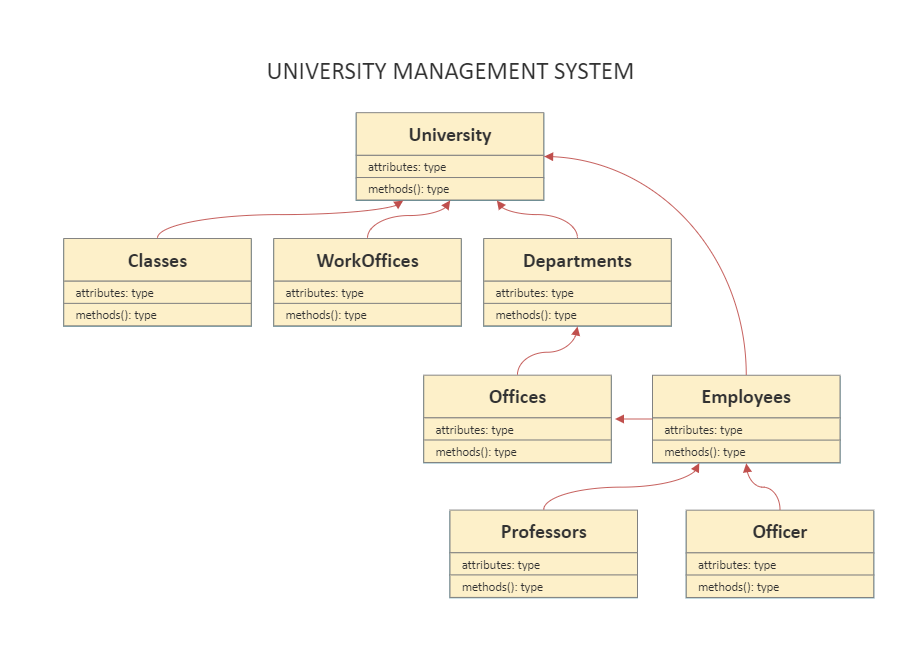

# University Management System 
- There are classrooms, study offices and departments belonging to the university.
- There are offices belonging to the departments.
- There are employees belonging to the university. These employees can be professors or civil servants.
- Every employee works in an office.

Draw the Class diagram describing this system.

Note: It is not necessary to specify the attributes and behaviors of the classes.

DIAGRAM

